# MwsyWin32 项目开发说明文件

## Win32 控制台项目

### Cs_CreateStruct

* 创建了Student结构体、赋值、打印值
* 简要代码如下

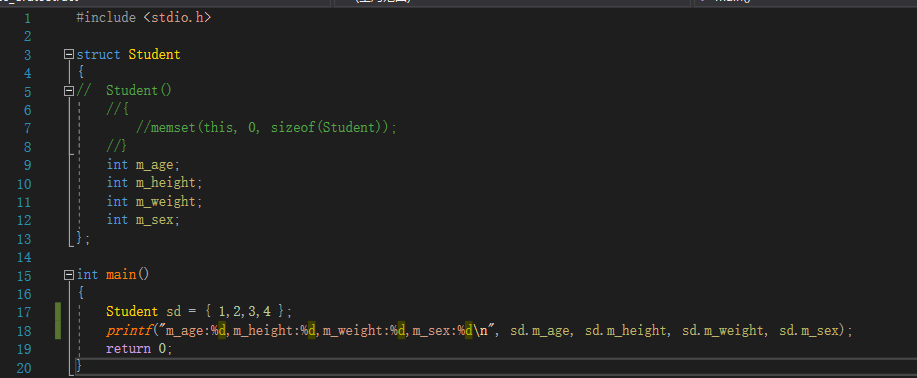

* 思路：主要是利用如下语句，对Student结构体进行赋值

  ```
  Student sd = {1,2,3,4};
  ```

* 结果

  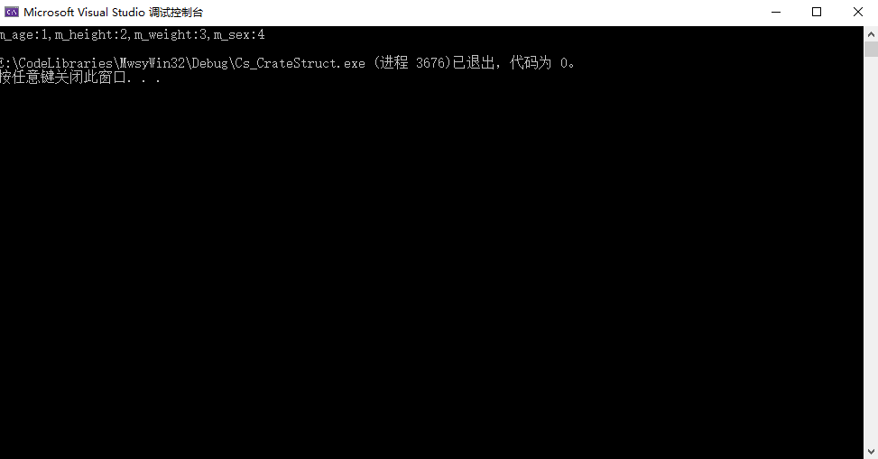

  

### Cs_DestroyClass

* 主要查看是否调用了类的析构函数

* 关键代码如下

  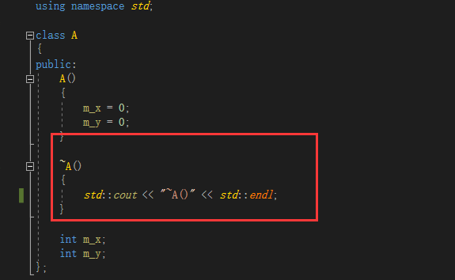

  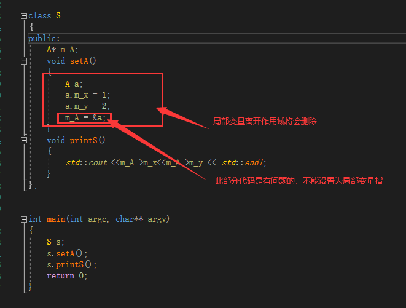

* 结果：

  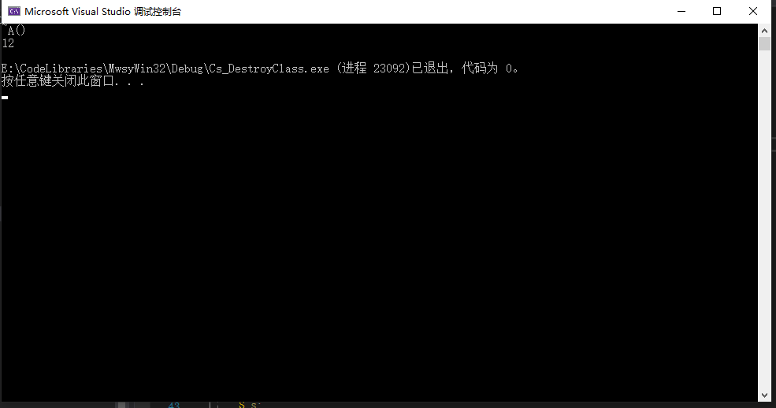

  ## Win32 应用程序(界面程序)
  
  ### Vc_HelloWorld 利用向导直接生成的HelloWorld应用程序
  
  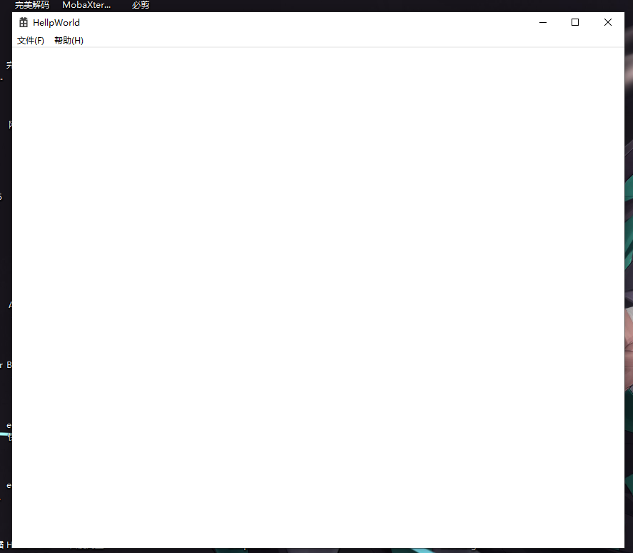

### VC_Button 在win32中展示按钮

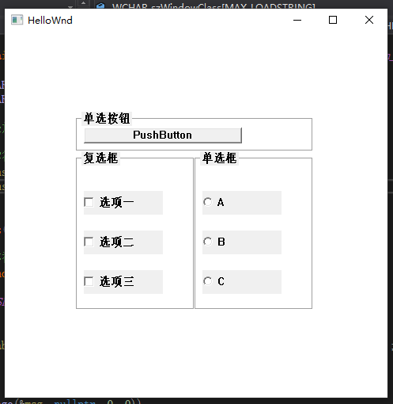

### Vc_ComboBox win32使用comboBox控件


### Vc_Edit win32使用edit控件

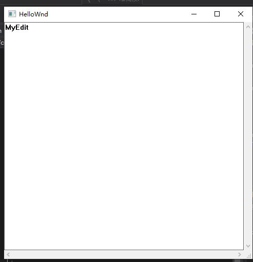

### Vc_InWnd win32中窗口中在嵌入一个窗口

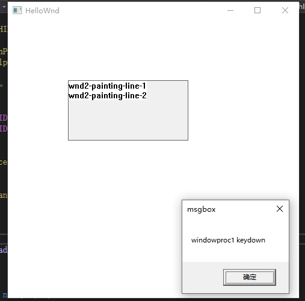

### Vc_ListBoxView win32中使用ListBoxView

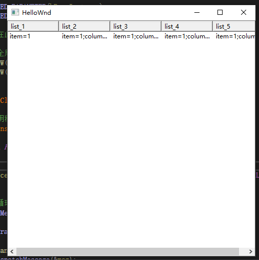

### Vc_menu Win32中使用右键菜单

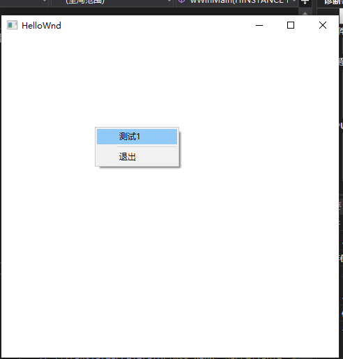

### Vc_ModelessDlg win32中使用模式对话框

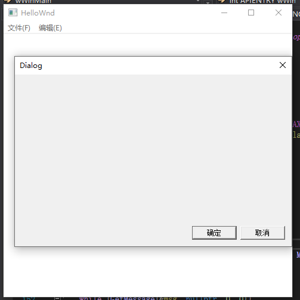

### Vc_ProgressBar win32中使用进度条

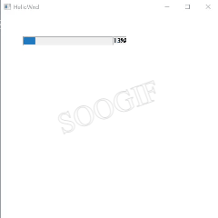

### Vc_RichEdit 富文本框

### Vc_TreeList win32中使用树形控件

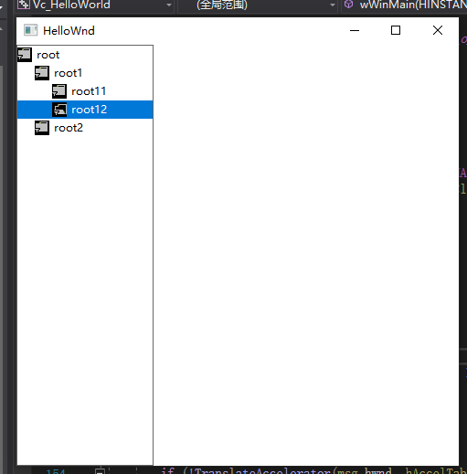

### Vc_Timer win32中使用定时器

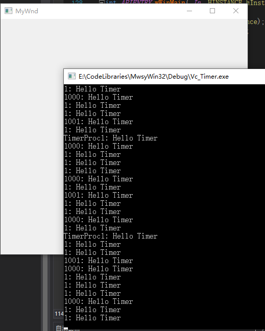