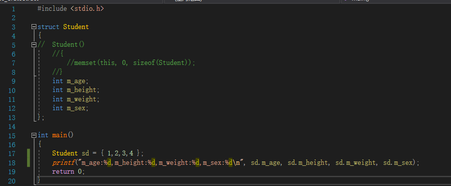
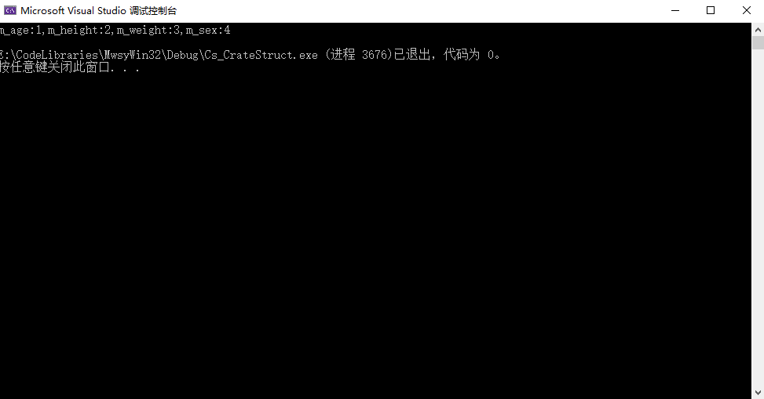
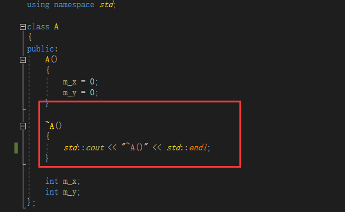
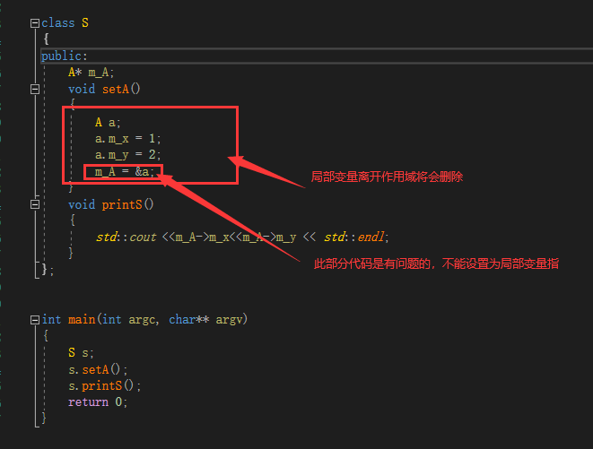

# MwsyWin32 项目开发说明文件

## Cs_CreateStruct

* 创建了Student结构体、赋值、打印值
* 简要代码如下



* 思路：主要是利用如下语句，对Student结构体进行赋值

  ```
  Student sd = {1,2,3,4};
  ```

* 结果

  

  

## Cs_DestroyClass

* 主要查看是否调用了类的析构函数

* 关键代码如下

  

  

* 结果：

  

  